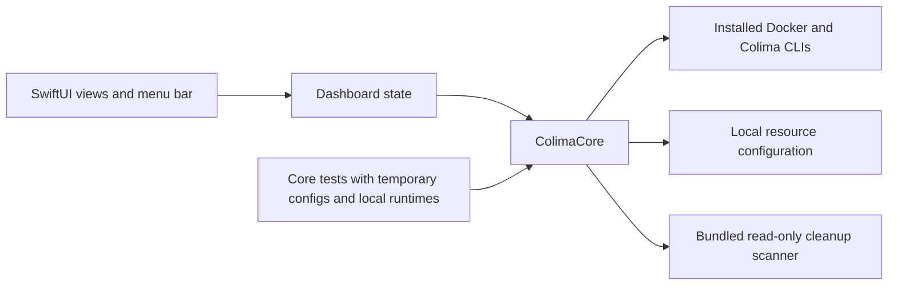

# Colima Mini

[](https://github.com/psg2/colima-mini/actions/workflows/ci.yml)

A native macOS dashboard for the default [Colima](https://github.com/abiosoft/colima)
profile. Manage existing containers, inspect their logs, ports and mounts, and
change VM resources from a small SwiftUI app and menu bar panel.

Colima Mini is an independent, unofficial project licensed under MIT.


The screenshot and published v0.4.0 ZIP show the earlier dashboard layout.
Build from source for the container pages, Volumes and Storage views described here.

## Install

1. Install [Homebrew](https://brew.sh), then install the runtime tools:

   ```sh
   brew install colima docker python
   ```

2. Create the default Colima profile if it doesn't exist:

   ```sh
   colima start
   ```

3. Download the universal app from [GitHub Releases](https://github.com/psg2/colima-mini/releases/latest),
   unzip it, and move **Colima Mini.app** to Applications.

The app requires macOS 14 or later. Release builds contain Apple Silicon and Intel
binaries. They are ad-hoc signed, not Apple Developer ID signed or notarized.
Building locally is also supported. Colima, Docker CLI and Python 3 are separate
dependencies; no Docker engine is bundled.

Use Docker Compose separately to create your projects. The app manages existing
containers and doesn't create Compose deployments or recreate missing services.

### Open a downloaded release for the first time

Download the ZIP and its matching `.sha256` file from the same release. In their
download directory, verify the archive before extracting it:

```sh
shasum -a 256 -c ColimaMini-X.Y.Z-macos-universal.zip.sha256
```

Replace `X.Y.Z` with the release version. The result must end in `OK`. This checks
the archive against the published checksum; it isn't Apple notarization.

After moving the app to Applications, try opening it. If macOS blocks it because
the developer can't be verified, follow Apple's
[instructions for opening a trusted app](https://support.apple.com/en-us/102445):

1. Open **System Settings** and select **Privacy & Security**.
2. Find the message for **Colima Mini** and select **Open Anyway**.
3. Review the app-specific prompt and select **Open** if you trust the download.

This creates an exception for this app. Keep Gatekeeper enabled. Managed Macs
might restrict this exception. You can also [build from source](#build-from-source).
Confirm that the dashboard opens and reports the default Colima profile.

## Use

Use the sidebar to open Overview, Containers, a Compose project, Volumes, Images,
Storage or Settings. The app reopens the last page you used. Press **Command+K** to
search loaded objects and pages. Type an action such as `restart`, `shell` or `logs`
to act on a container. Use the arrow keys to choose a result and Return to open it.
Settings stays aligned at the bottom and is also available with **Command+,**.

- Expand or collapse each Compose project, use the direct **Collapse all** or
  **Expand all** action, or switch to a flat container list. Searching reveals
  matching services without discarding your saved collapsed groups.
- Overview shows the VM, counts, reclaimable estimates, containers that need
  attention, resource meters and recent CPU. Overview CPU is relative to allocated
  VM capacity; row CPU follows Docker's 100% per core convention.
- Each project shows where Compose ran it. Claude, Codex, Conductor and Orca
  worktrees are labeled, and a project whose folder was removed shows
  **Folder missing**. Open the folder in Finder, Terminal or a detected editor.
- Rows show health, uptime and published ports. Click a port to copy
  `localhost:PORT`; its menu opens HTTP or HTTPS explicitly. Hover a row for Logs,
  Shell and Restart, or right-click for every action.
- **Shell** opens `docker exec -it` in your terminal app, preferring bash.
- Filter by project, search names or images, and show only running containers.
- Start, stop and restart containers or displayed project groups, with confirmation.
- Open a container page for Overview, Logs, Ports and Mounts. Use Back to return
  to the originating list and its filters.
- Follow logs live: the last 500 lines, then new output as it arrives, keeping up
  to 5,000 lines. Pause, scroll with the latest output, search and copy the
  displayed text.
- Follow a whole project with **Logs** on its page, **Show logs** in its menu or
  Command+K. Each line names its service, and **Services** hides the ones you
  don't need.
- Inspect published port bindings and copy their addresses. TCP doesn't identify
  an HTTP service, so database ports don't get an inferred browser URL.
- Inspect named and anonymous volumes and their container mount destinations. References include
  stopped containers; an unattached volume isn't automatically safe to delete.
- Open Storage for disk measurements, **Reclaim space** and **Review unused
  containers**. The unused-container scanner only produces a report.
- Change CPU, RAM and refresh interval in Settings.

### Diagnose a container

Overview shows health, exit code, OOM status and restart count. Inspection updates
after a lifecycle action, on explicit Refresh, and every 30 seconds while Overview
is active. CPU and memory history keeps up to 60 samples collected while the
dashboard is open. Missing measurements remain unavailable.

Only a visible, active Logs tab streams. Leaving the tab, pausing or switching
apps stops the `docker logs --follow` process. A restarted container is followed
again once it runs. Search pauses automatic scrolling; Pause keeps the last
buffer. A stream error preserves that buffer and shows a separate error. Ports requires an explicit HTTP or HTTPS choice
when opening a web endpoint.

### Inspect images

Images shows virtual, shared and unique layer sizes and links to containers using
an image, including stopped containers. Shared layers make summed image virtual
sizes different from physical disk usage. The view is read-only.

### Understand storage measurements

Storage reports these measurements separately:

- **Configured capacity:** the Colima data disk's configured limit.
- **VM filesystem:** its size, used bytes and available bytes. Filesystem overhead
  and reserved blocks can make available space smaller than size minus used space.
- **Docker objects:** images, containers, volumes and build cache, with Docker's
  reclaimable estimates. Shared image layers aren't independent physical copies.
- **Mac disk footprint:** allocated blocks of the identified VM image files.
  Sparse files can have a logical size larger than their allocated blocks.

Unknown sizes and unsupported VM image layouts show Unavailable rather than zero.
Mac allocation is an estimate under APFS sharing and compression. Docker reclaimable
bytes don't promise an equal reduction in the Mac disk footprint. Volume metadata
uses Linux mount paths; these aren't folders you can open in Finder.

Storage refreshes separately from the container list. A storage read failure
doesn't prevent container navigation or controls. Apart from Reclaim space, the
app doesn't remove Docker objects. It never removes named volumes, resizes VM
disks or compacts disk images.

### Reclaim space

**Reclaim space…** (Storage, Overview or Command+K) previews what can go:

- **Selected by default:** build cache, dangling images and unused custom networks.
- **Marked Review, selected only by you:**
  - stopped containers;
  - tagged images that no container uses, stopped ones included;
  - unattached anonymous volumes.

Each category lists its items and Docker's size estimate. After confirmation, the
app removes exactly the listed items one by one, by ID and without `--force`.
Docker refuses anything that started running or gained a container since the
preview, and the result lists those refusals. Named volumes are never offered.
Build cache uses `docker builder prune`, which only removes cache that isn't in use.
Removing stopped containers can leave newly unused images or volumes; measure
again to see them. Space freed inside the VM may not shrink the Mac disk footprint
right away.

To print the preview without opening a window:

```sh
"dist/Colima Mini.app/Contents/MacOS/ColimaMini" --reclaim-plan
```

### Change VM resources

**Save for next start** updates CPU and memory without interrupting the VM.
**Apply & restart…** asks for confirmation, restarts Colima, verifies its allocation,
and restores the containers running immediately before Colima was stopped. Docker volumes are kept.
Settings modify only root `cpu` and `memory` fields in the local profile, preserving
other settings, comments and permissions. The first original file is retained as
`colima.yaml.mini-backup` beside the profile.

The menu bar shows a monochrome llama matching the app icon. It dims while Colima
is stopped and shows a count when containers need attention. Its panel lists those
containers first, then expandable projects with ports, shells and actions.
When a container exits unexpectedly, starts failing its health check or enters a
restart loop, the app sends a notification; clicking it opens the logs. Changes
made from Colima Mini don't notify, and exit code 143 (a normal `docker stop`)
is ignored. Turn this off or open the app at login in Settings. Refresh slows to
at most every 30 seconds while another app is in front.
Closing the dashboard keeps the menu bar available. Quitting Colima Mini leaves Colima running.
Docker operations explicitly select the `colima` context; a foreign terminal
`DOCKER_HOST` or `DOCKER_CONTEXT` does not redirect the app.

## Build from source

Use Swift 6 or later with Xcode or matching Command Line Tools. No Xcode project
or external Swift package dependencies are needed.

```sh
git clone https://github.com/psg2/colima-mini.git
cd colima-mini
./Scripts/build-app.sh --install
open "$HOME/Applications/Colima Mini.app"
```

You can also double-click `run-ui.command` in Finder. It builds the app and opens it.
For a universal build, use `./Scripts/build-app.sh --universal`.

To preview with synthetic data:

```sh
./Scripts/run.sh --fixture "$PWD/Tests/ColimaCoreTests/Fixtures/sample.json"
```

The launcher creates a separate Sample instance even if the real dashboard is
already running. Confirm that its title includes **Sample data** and its sidebar
shows **Sample**. Sample mode disables runtime, container and resource changes.

To check your actual runtime without opening a window:

```sh
"dist/Colima Mini.app/Contents/MacOS/ColimaMini" --check
```

To print the actual cleanup report without changing containers:

```sh
"dist/Colima Mini.app/Contents/MacOS/ColimaMini" --scan
```

Tools are discovered through `PATH` and common Homebrew locations. Advanced users
can set absolute executable overrides with `COLIMA_MINI_DOCKER`,
`COLIMA_MINI_COLIMA` and `COLIMA_MINI_PYTHON3`. `COLIMA_HOME` selects the local
profile directory when set.

## Architecture



```text
Sources/ColimaCore/       Runtime operations, process execution, models and config
Sources/ColimaAppState/   Navigation, refresh coordination and observable state
Sources/ColimaMini/       App entry point and individual SwiftUI views
Tests/ColimaCoreTests/    Parser, process, config and runtime integration tests
Tests/ColimaAppStateTests/ Navigation and observable state tests
Resources/               Application icon source
Scripts/                 Build, verification, packaging and installation
.github/workflows/       macOS CI and tag-based release publication
```

The app bundle contains its scanner and does not depend on a dotfiles checkout
or a compile-time source directory. The scanner requires Python 3 and uses only
its standard library. Subprocess output is held in private temporary files and
removed after the command completes. Logs stay local.

## Validate

```sh
./Scripts/check.sh
./Scripts/build-app.sh
./Scripts/test-app.sh
```

CI runs on standard GitHub-hosted Apple Silicon and Intel macOS runners. It checks
Swift formatting, unit and subprocess integration tests, scanner behavior,
release compilation, signatures and a relocated app. Runtime tests use local fake
executables because hosted macOS runners cannot run nested Colima VMs.

Manual validation on a Mac with Colima remains necessary for actual VM restart,
native interaction and networking. Automated checks do not stop your local VM.

## Release

Update `VERSION`, run the validation commands, and create the corresponding `vX.Y.Z`
tag. The release workflow verifies the version, reruns checks, builds a universal
app and publishes a ZIP with its SHA-256 checksum. It can also be dispatched
manually for an existing matching version tag.

```sh
./Scripts/package-release.sh
```

This command builds the local release archive; it does not publish it.

## References

- [Trimmy](https://github.com/steipete/Trimmy) and [CodexBar](https://github.com/steipete/CodexBar):
  native Swift apps with package-based core and app separation.
- [Docker Desktop](https://docs.docker.com/desktop/use-desktop/container/):
  Compose grouping, project controls, metrics and logs.
- [OrbStack](https://docs.orbstack.dev/settings) and [ColimaBar](https://github.com/tdi/colimabar):
  resource settings and compact native status controls.

See [icon provenance](docs/icon.md) for the generated icon and its prompt.
