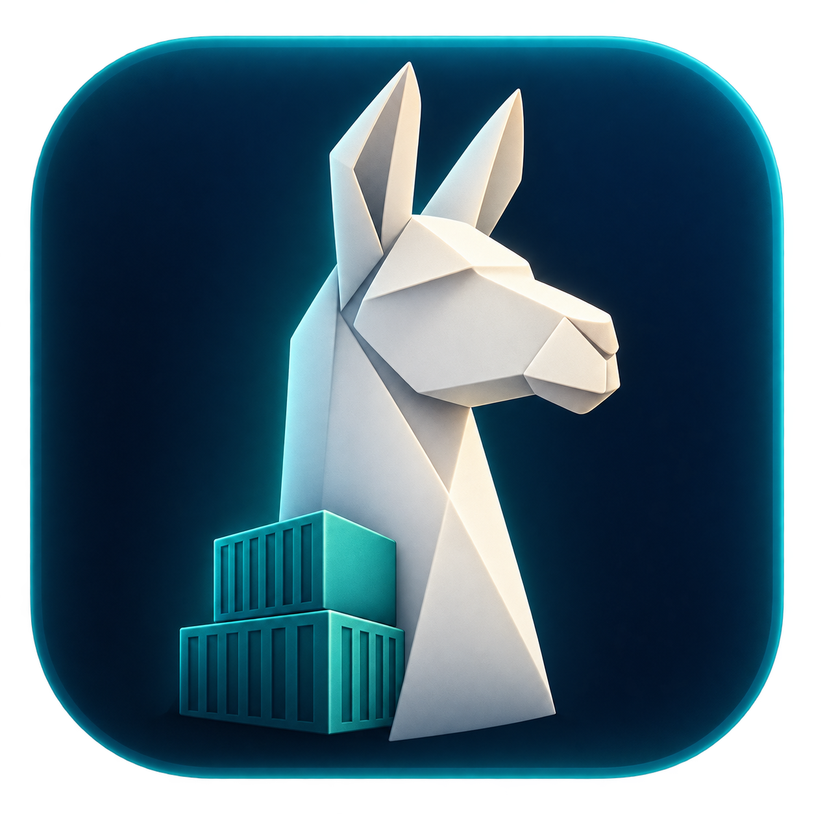
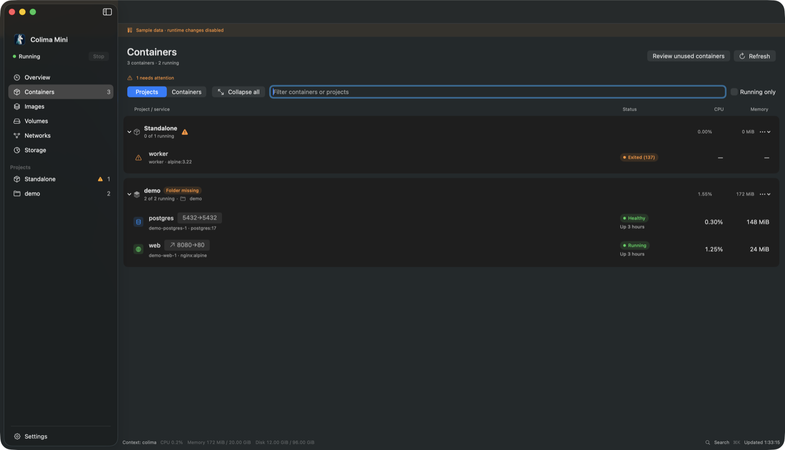
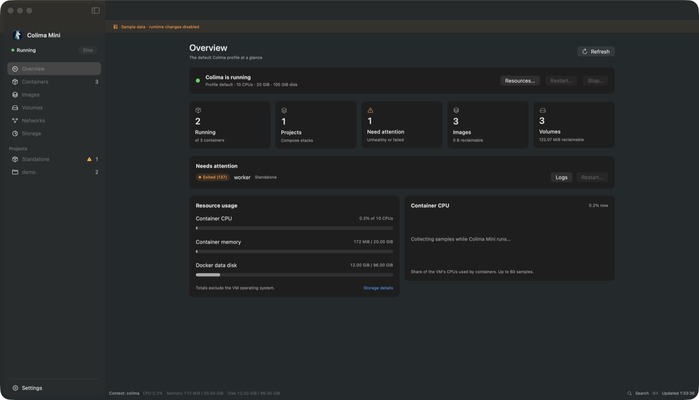

# Colima Mini

[](https://github.com/psg2/colima-mini/actions/workflows/ci.yml)

A native macOS app and menu bar panel for Docker on [Colima](https://github.com/abiosoft/colima).
It shows your Compose projects and containers with their logs, ports, mounts and
environment, and it manages images, volumes, networks, disk space and the VM's
CPU, memory and disk. It works on the default Colima profile.

Colima Mini is an independent, unofficial project under the MIT license.



## Install

1. Install the runtime with [Homebrew](https://brew.sh) and start the default profile:

   ```sh
   brew install colima docker python
   colima start
   ```

2. Download the app from [GitHub Releases](https://github.com/psg2/colima-mini/releases/latest),
   unzip it and move **Colima Mini.app** to Applications.

It needs macOS 14 or later and runs on Apple Silicon and Intel. The app doesn't
bundle a Docker engine; it drives the Colima and Docker CLIs you installed.

The latest release (v0.4.0) predates most of what this page describes. Until the
next one, [build from source](#build-from-source) to get it.

### Open a downloaded release for the first time

Releases are ad-hoc signed, not notarized, so macOS asks before the first launch.
Check the download against its published checksum first:

```sh
shasum -a 256 -c ColimaMini-X.Y.Z-macos-universal.zip.sha256
```

It must print `OK`. Then open the app. If macOS blocks it, open **System Settings**,
go to **Privacy & Security**, and choose **Open Anyway** next to Colima Mini
([Apple's instructions](https://support.apple.com/en-us/102445)). That allows this
one app and leaves Gatekeeper on.

## What it does

- **Containers.** Compose projects collapse into groups, labeled with where they
  ran (a folder, or a Claude, Codex, Conductor or Orca worktree). Start, stop,
  restart or remove containers one at a time or several at once. Run Compose
  **Up**, **Pull** and **Down** on a project. Click a port to copy it, or to open
  known web UIs such as pgweb, Adminer or Grafana.
- **Container pages.** Live logs with search, wrap and pause; ports; mounts;
  environment variables with secrets masked. **Shell** and **Open** use the
  terminal and editor you pick from their menus.
- **Unused containers.** **Review unused containers** finds stacks whose folder
  was deleted, stopped for over a day, or idle, and offers to stop or remove them.
- **Images, volumes and networks.** Sizes, which containers use each one, and
  removal of the unused ones, singly or in bulk. Docker refuses anything still in use.
- **Disk.** Storage shows the VM disk, Docker's usage and the space taken on your
  Mac. **Reclaim space** previews build cache, unused images, networks, stopped
  containers and anonymous volumes before removing what you pick. Named volumes
  are never part of it.
- **VM.** Change CPU, memory and disk in Settings, then save for the next start
  or restart now. Running containers come back after the restart.
- **Menu bar.** Status, usage, containers that need attention and every project
  with its actions. Notifications when a container crashes, fails its health
  check or keeps restarting.

The [user guide](docs/guide.md) covers each page, and
[storage and cleanup](docs/storage.md) explains the measurements and what each
removal touches.



### Keyboard shortcuts

The **Go** and **Container** menus list them all.

| Keys | Action |
| --- | --- |
| ⌘1 … ⌘6 | Overview, Containers, Images, Volumes, Networks, Storage |
| ⌘K | Search and actions |
| ⌘F | Filter the current page or search logs |
| ⌘[ or Esc | Back |
| ⌘R | Refresh |
| ⌘, | Settings |
| ⌥⌘1 … ⌥⌘5 | Container tabs: Overview, Logs, Ports, Mounts, Env |
| ⇧⌘T | Shell in the container |
| ⇧⌘O | Open the project folder |
| ⇧⌘S / ⇧⌘R | Stop or start / restart (asks first) |
| ⌘⌫ | Remove the stopped container (asks first) |

### What it won't do

Every removal asks first and runs without `--force`, so Docker refuses anything a
container still uses. The app never compacts disk images or shrinks the VM disk.
It only talks to the `colima` Docker context, whatever `DOCKER_HOST` or
`DOCKER_CONTEXT` your shell sets. Quitting it leaves Colima running.

## Build from source

You need Swift 6 or later from Xcode or the Command Line Tools.

```sh
git clone https://github.com/psg2/colima-mini.git
cd colima-mini
./Scripts/build-app.sh --install
open "$HOME/Applications/Colima Mini.app"
```

To try it with sample data instead of your containers:

```sh
./Scripts/run.sh --fixture "$PWD/Tests/ColimaCoreTests/Fixtures/sample.json"
```

[Development](docs/development.md) covers the architecture, tests, command-line
checks and releases.

## References

- [Trimmy](https://github.com/steipete/Trimmy) and [CodexBar](https://github.com/steipete/CodexBar)
  for the package layout of a native Swift app.
- [Docker Desktop](https://docs.docker.com/desktop/use-desktop/container/),
  [OrbStack](https://docs.orbstack.dev/settings) and [ColimaBar](https://github.com/tdi/colimabar)
  for Compose grouping, resource settings and menu bar controls.

The icon's prompt and provenance are in [docs/icon.md](docs/icon.md).
