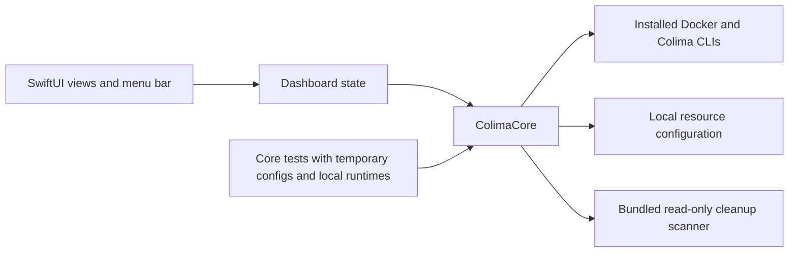

# Colima Mini

[](https://github.com/psg2/colima-mini/actions/workflows/ci.yml)

A native macOS dashboard for the default [Colima](https://github.com/abiosoft/colima)
profile. Manage existing containers, inspect logs and ports, and change VM resources
from a small SwiftUI app and menu bar panel.

Colima Mini is an independent, unofficial project licensed under MIT.


## Install

1. Install [Homebrew](https://brew.sh), then install the runtime tools:

   ```sh
   brew install colima docker python
   ```

2. Create the default Colima profile if it doesn't exist:

   ```sh
   colima start
   ```

3. Download the universal app from [GitHub Releases](https://github.com/psg2/colima-mini/releases/latest),
   unzip it, and move **Colima Mini.app** to Applications.

The app requires macOS 14 or later. Release builds contain Apple Silicon and Intel
binaries. They are ad-hoc signed, not Apple Developer ID signed or notarized.
Building locally is also supported. Colima, Docker CLI and Python 3 are separate
dependencies; no Docker engine is bundled.

Use Docker Compose separately to create your projects. The app manages existing
containers and doesn't create Compose deployments or recreate missing services.

## Use

- Expand or collapse Compose projects, or switch to a flat container list.
- See project resource totals, VM allocation and container usage. Overview CPU is
  relative to allocated VM capacity; row CPU follows Docker's 100% per core convention.
- Filter by project, search names or images, and show only running containers.
- Start, stop and restart containers or displayed project groups, with confirmation.
- Read the last 200 log lines, search them and copy the displayed text.
- Inspect published ports, copy addresses and open them in a browser.
- Open **Settings** or press **Command+,** to change CPU, RAM and refresh interval.
- Use **Unused containers** for the bundled cleanup report. The app never applies cleanup.

**Save for next start** updates CPU and memory without interrupting the VM.
**Apply & restart…** asks for confirmation, restarts Colima, verifies its allocation,
and starts containers that were running before the restart. Docker volumes are kept.
Settings modify only root `cpu` and `memory` fields in the local profile, preserving
other settings, comments and permissions. The first original file is retained as
`colima.yaml.mini-backup` beside the profile.

The menu bar shows a monochrome llama matching the app icon. Closing the dashboard
keeps the menu bar available. Quitting Colima Mini leaves Colima running.
Docker operations explicitly select the `colima` context; a foreign terminal
`DOCKER_HOST` or `DOCKER_CONTEXT` does not redirect the app.

## Build from source

Use Swift 6 or later with Xcode or matching Command Line Tools. No Xcode project
or external Swift package dependencies are needed.

```sh
git clone https://github.com/psg2/colima-mini.git
cd colima-mini
./Scripts/build-app.sh --install
open "$HOME/Applications/Colima Mini.app"
```

You can also double-click `run-ui.command` in Finder. It builds the app and opens it.
For a universal build, use `./Scripts/build-app.sh --universal`.

To preview with synthetic data:

```sh
./Scripts/run.sh --fixture "$PWD/Tests/ColimaCoreTests/Fixtures/sample.json"
```

Sample mode disables runtime, container and resource changes.

To check your actual runtime without opening a window:

```sh
"dist/Colima Mini.app/Contents/MacOS/ColimaMini" --check
```

To print the actual cleanup report without changing containers:

```sh
"dist/Colima Mini.app/Contents/MacOS/ColimaMini" --scan
```

Tools are discovered through `PATH` and common Homebrew locations. Advanced users
can set absolute executable overrides with `COLIMA_MINI_DOCKER`,
`COLIMA_MINI_COLIMA` and `COLIMA_MINI_PYTHON3`. `COLIMA_HOME` selects the local
profile directory when set.

## Architecture



```text
Sources/ColimaCore/       Runtime operations, process execution, models and config
Sources/ColimaMini/       App entry point, observable state and individual views
Tests/ColimaCoreTests/    Parser, process, config and runtime integration tests
Resources/               Application icon source
Scripts/                 Build, verification, packaging and installation
.github/workflows/       macOS CI and tag-based release publication
```

The app bundle contains its scanner and does not depend on a dotfiles checkout
or a compile-time source directory. The scanner requires Python 3 and uses only
its standard library. Subprocess output is held in private temporary files and
removed after the command completes. Logs stay local.

## Validate

```sh
./Scripts/check.sh
./Scripts/build-app.sh
./Scripts/test-app.sh
```

CI runs on standard GitHub-hosted Apple Silicon and Intel macOS runners. It checks
Swift formatting, unit and subprocess integration tests, scanner behavior,
release compilation, signatures and a relocated app. Runtime tests use local fake
executables because hosted macOS runners cannot run nested Colima VMs.

Manual validation on a Mac with Colima remains necessary for actual VM restart,
native interaction and networking. Automated checks do not stop your local VM.

## Release

Update `VERSION`, run the validation commands, and create the corresponding `vX.Y.Z`
tag. The release workflow verifies the version, reruns checks, builds a universal
app and publishes a ZIP with its SHA-256 checksum. It can also be dispatched
manually for an existing matching version tag.

```sh
./Scripts/package-release.sh
```

This command builds the local release archive; it does not publish it.

## References

- [Trimmy](https://github.com/steipete/Trimmy) and [CodexBar](https://github.com/steipete/CodexBar):
  native Swift apps with package-based core and app separation.
- [Docker Desktop](https://docs.docker.com/desktop/use-desktop/container/):
  Compose grouping, project controls, metrics and logs.
- [OrbStack](https://docs.orbstack.dev/settings) and [ColimaBar](https://github.com/tdi/colimabar):
  resource settings and compact native status controls.

See [icon provenance](docs/icon.md) for the generated icon and its prompt.
