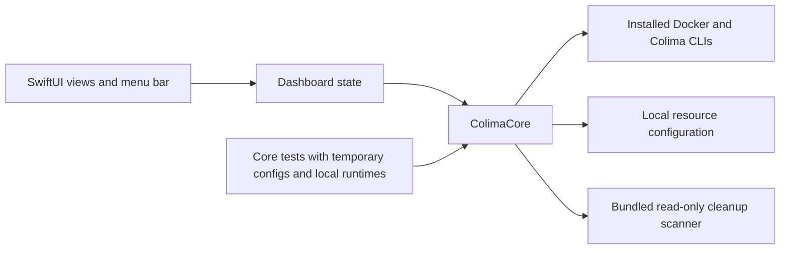

# Architecture



The Swift package has three targets. Each depends only on the one below it.

```text
Sources/ColimaCore/        Runtime operations, process execution, models and config
Sources/ColimaAppState/    Navigation, refresh coordination and observable state
Sources/ColimaMini/        App entry point and SwiftUI views
Tests/ColimaCoreTests/     Parser, process, config and runtime integration tests
Tests/ColimaAppStateTests/ Navigation and state tests
Resources/                 Info.plist and the application icon source
Scripts/                   Build, bundle checks, scanner tests and packaging
.github/workflows/         CI and tag-based releases
```

`Scripts/build.sh` compiles the `ColimaMini` product with SwiftPM and assembles
the `.app` bundle. It copies `Resources/Info.plist` and stamps the version from
`VERSION` into it, builds the icon set and signs the bundle ad hoc.

Every Docker command passes `--context colima`. The app bundles its cleanup
scanner, a Python 3 script that uses only the standard library. Subprocess output
goes to private temporary files that the app deletes when the command finishes.
Logs never leave the Mac.
