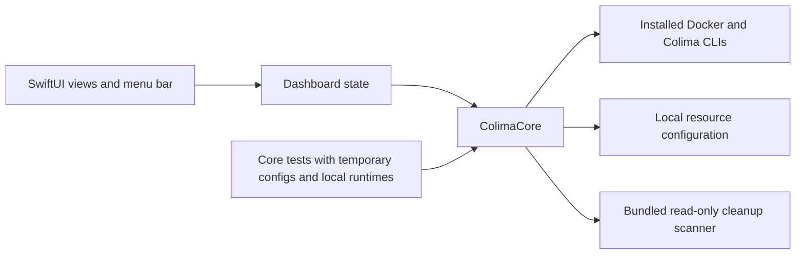

# Development

## Build

You need Swift 6 or later from Xcode or the Command Line Tools. There's no Xcode
project and no external package dependency.

```sh
./Scripts/build-app.sh            # dist/Colima Mini.app
./Scripts/build-app.sh --install  # also copies it to ~/Applications
./Scripts/build-app.sh --universal
```

Double-clicking `run-ui.command` in Finder builds the app and opens it.

### Sample data

```sh
./Scripts/run.sh --fixture "$PWD/Tests/ColimaCoreTests/Fixtures/sample.json"
```

This opens a separate instance titled **Sample data**, even when the real
dashboard is running. Sample mode turns off every change to the runtime,
containers and resources.

### Command-line checks

The app binary has read-only modes that print and exit without opening a window:

```sh
APP="dist/Colima Mini.app/Contents/MacOS/ColimaMini"
"$APP" --check         # runtime summary as JSON
"$APP" --scan          # unused-container report
"$APP" --reclaim-plan  # what Reclaim space would offer
```

The app finds `docker`, `colima` and `python3` through `PATH` and the usual
Homebrew locations. `COLIMA_MINI_DOCKER`, `COLIMA_MINI_COLIMA` and
`COLIMA_MINI_PYTHON3` override them with absolute paths. `COLIMA_HOME` picks the
profile directory.

## Architecture



```text
Sources/ColimaCore/        Runtime operations, process execution, models and config
Sources/ColimaAppState/    Navigation, refresh coordination and observable state
Sources/ColimaMini/        App entry point and SwiftUI views
Tests/ColimaCoreTests/     Parser, process, config and runtime integration tests
Tests/ColimaAppStateTests/ Navigation and state tests
Resources/                 Application icon source
Scripts/                   Build, verification, packaging and installation
.github/workflows/         macOS CI and tag-based releases
```

Every Docker command passes `--context colima`. The app bundles its cleanup
scanner, a Python 3 script that uses only the standard library. Subprocess output
goes to private temporary files that the app deletes when the command finishes.
Logs never leave the Mac.

## Validate

```sh
./Scripts/check.sh      # formatting, build, unit and integration tests
./Scripts/build-app.sh
./Scripts/test-app.sh   # packaged and relocated app checks
```

CI runs these on GitHub-hosted Apple Silicon and Intel macOS runners. Hosted
runners can't run a nested Colima VM, so runtime tests use fake `docker` and
`colima` executables. Restarting a real VM, clicking through the UI and
networking still need a manual check on a Mac with Colima. The automated checks
never stop your local VM.

## Release

Update `VERSION`, run the checks and push a matching `vX.Y.Z` tag. The release
workflow verifies the version, runs the checks again, builds a universal app and
publishes a ZIP with its SHA-256 checksum. You can also dispatch it by hand for an
existing tag.

`./Scripts/package-release.sh` builds the same archive locally without publishing it.
