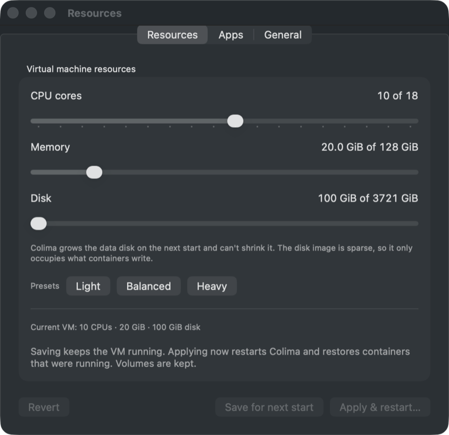

# User guide

How each part of Colima Mini works. The [README](../README.md) has install steps
and a summary.

## Getting around

The sidebar opens Overview, Containers, Images, Volumes, Networks and Storage,
then one entry per Compose project. The app reopens the last page you used.
Detail pages have a Back button named after the page it returns to; Escape and
⌘[ do the same, and clicking the section in the sidebar goes back to its list.

**Command+K** searches pages, projects, containers, volumes and images. Type an
action such as `restart`, `shell` or `logs` to run it on a container.

Settings is its own window with Resources, Apps and General tabs. Open it from the
bottom of the sidebar, the menu bar, Command+K or ⌘,.

Closing the dashboard keeps the menu bar panel. By default the Dock icon goes away
with the window and comes back when you reopen it; turn that off in Settings. With
**Open at login** on, the app starts in the menu bar without opening the dashboard.

## Overview

The VM's status and allocation, with **Resources…**, **Restart…** and **Stop…**.
Below it are counts of running containers, projects, containers that need
attention, images and volumes. Each card opens its page; Running opens the list
filtered to running containers.

Resource usage compares container CPU and memory with the VM allocation, and shows
the Docker data disk. Overview CPU is a share of the VM's CPUs. Container rows use
Docker's convention of 100% per core.

The status bar at the bottom repeats CPU, memory and disk. When less than a tenth
of the data disk, or less than 3 GiB, is free, it shows **Low disk**, which opens
Storage.

## Containers

Projects group their services. Collapse or expand them one at a time or all at
once, or switch to a flat list. Searching expands the projects that match without
forgetting the ones you collapsed.

Each project shows where Compose ran it: a folder, or a worktree from Claude,
Codex, Conductor or Orca. **Folder missing** marks a project whose folder is gone.

- **Open** sends the project folder to your default editor in one click. Its menu
  lists the editors and terminals you have installed; the one you pick becomes the
  default. It can also open the Git remote's page in the browser.
- **Compose** actions in the project menu: **Up**, **Pull images**, **Down…** and
  **Down and delete volumes…**, each after a confirmation. The app reads the
  folder, compose files and env files from Compose's container labels. Up and Pull
  need the folder to exist; Down also works after a worktree is deleted.
- **Logs** on a project follows every service at once. Each line names its
  service, and **Services** hides the ones you don't need.

Rows show health, uptime, published ports, CPU and memory, with an icon for the
kind of image (database, cache, queue, web tool…). Hover a row for Logs, Shell and
Restart, or right-click for everything else.

Click a port to copy `localhost:PORT`. Its menu opens it as HTTP or HTTPS. For
images known to serve a web page on that port (pgweb, Adminer, Grafana, nginx, the
RabbitMQ management UI and others) the chip shows ↗ and a click opens the browser.

To act on several containers, hover a row's icon and click the circle, or ⌘-click
rows. While some are selected, a click toggles a row. The bar above the list
starts, stops, restarts or removes the ones each action applies to, after one
confirmation. Escape clears the selection.

Removing a container keeps its volumes. Only stopped containers can be removed.

### Unused containers

**Review unused containers** in the Containers header scans every container and
groups them by project with a verdict: project folder deleted, stopped for over a
day, running but idle, quiet but logged recently, or in use. Each group offers
**Stop** or **Remove…**. The scan itself changes nothing.

Projects whose folder was deleted show a folder badge on that button and in the
sidebar, and the menu bar lists them.

## Container page

The header shows status, uptime, ports, CPU, memory, network and disk I/O and
process count, with **Shell**, **Open**, **Stop…** and **Restart…**.

**Shell** opens `docker exec -it` in your terminal, preferring bash. Like Open, its
menu lists the terminals you have installed (Terminal, iTerm, cmux, Ghostty, Warp,
WezTerm, kitty, Alacritty) and makes the one you pick the default. It can also copy
the `docker exec` command.

- **Overview** shows health, exit code, OOM status and restart count, and up to 60
  CPU and memory samples collected while the dashboard is open. It refreshes after
  an action, on Refresh, and every 30 seconds.
- **Logs** loads the last 500 lines and follows new output, keeping up to 5,000.
  Pause, follow the latest line, show timestamps, wrap long lines, search and copy.
  Only the visible Logs tab streams; leaving it, pausing or switching apps stops
  `docker logs --follow`. A restarted container is picked up again once it runs.
- **Ports** lists published bindings. Opening one in a browser needs an explicit
  HTTP or HTTPS choice, since a TCP port doesn't say what it serves.
- **Mounts** lists bind mounts and volumes with their destinations.
- **Env** lists environment variables. Names that usually hold credentials
  (password, secret, token, key, DSN…) and URLs with a password stay masked until
  you reveal them one at a time, and a masked value can't be copied. The app reads
  the values only while the tab is open.

## Images

Each image shows its size, which containers use it (stopped ones included) and an
icon for its kind. Filter to unused images and sort by size. Virtual sizes include
layers shared with other images, so they add up to more than the disk holds.

**Pull latest** runs `docker pull` for the tag. **Remove…** runs `docker image rm`
without force on an unused image. To remove several, hover an unused image's icon or
⌘-click rows; the bar shows the space in their own layers and **Remove N…** asks
once. **Remove unused…** in the header opens the [Reclaim space](storage.md#reclaim-space)
preview limited to images.

## Volumes

The list starts with named volumes and remembers the kind you pick (Named,
Anonymous or All). References include stopped containers, and a volume page lists
the containers that mount it. An unattached volume isn't automatically safe to
delete; its data may still matter.

An unattached volume's page offers **Remove…**, which deletes it and its data. To
delete several, select them the same way as images; the bar shows their total size.
**Remove anonymous…** in the header opens the Reclaim space preview limited to
anonymous volumes.

## Networks

Each network shows its driver, subnet, Compose project and the running containers
on it with their addresses. **Remove…** deletes an unused custom network without
force. **Remove unused…** previews all of them.

## Settings

- **Resources** changes CPU, memory and disk. See
  [Change VM resources](storage.md#change-vm-resources).
- **Apps** picks the editor for project folders and the terminal for shells.
- **General** sets the refresh interval, failure notifications, the Dock icon and
  Open at login.

## Menu bar

The llama icon dims while Colima is stopped and shows a count when containers need
attention. The panel lists those containers first, then each project with its
ports, shells and actions, plus CPU, memory and disk use.

When a container exits unexpectedly, starts failing its health check or keeps
restarting, the app sends a notification; clicking it opens the logs. Changes made
from Colima Mini don't notify, and exit code 143 (a normal `docker stop`) is ignored.
Turn notifications off in Settings. While another app is in front, the app refreshes
at most every 30 seconds.
