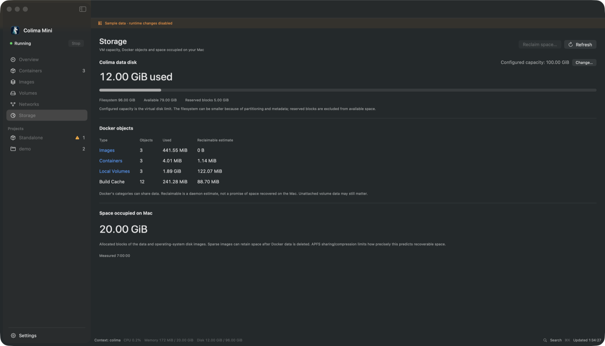

# Storage and cleanup

What the Storage page measures, what each cleanup removes, and how VM resource
changes are applied.



## Measurements

Storage reports four numbers separately, because they answer different questions:

- **Configured capacity** is the Colima data disk's limit.
- **VM filesystem** is that disk's size, used and available bytes. Filesystem
  overhead and reserved blocks make available space smaller than size minus used.
- **Docker objects** are images, containers, volumes and build cache, with Docker's
  reclaimable estimate for each. Images share layers, so their sizes overlap.
- **Space occupied on Mac** is the allocated blocks of the VM's disk image files.
  The images are sparse, so they take less than their logical size.

A size the app can't read shows Unavailable, never zero. Under APFS cloning and
compression the Mac number is an estimate, and space Docker frees inside the VM may
not shrink it right away. Volume paths are Linux paths inside the VM, not folders
you can open in Finder.

Storage refreshes on its own schedule. If it fails to read, the rest of the app
keeps working. The Images, Containers and Local Volumes rows link to their pages.

## Reclaim space

**Reclaim space…** in the Storage header (also in the Go menu and Command+K)
previews everything that can go, grouped by kind:

- Selected by default, because they can be rebuilt or downloaded again: build cache,
  dangling images and unused custom networks.
- Marked for review and left unselected: stopped containers, tagged images no
  container uses, and unattached anonymous volumes.

Images, Volumes and Networks have their own **Remove unused…** (or **Remove
anonymous…**). It opens the same preview limited to that page's objects.

Each kind lists its items and Docker's size estimate. After you confirm, the app
removes exactly those items, one at a time, by ID and without `--force`. Docker
refuses anything that started or gained a container since the preview, and the
result lists the refusals. Build cache goes through `docker builder prune`, which
only removes cache nothing uses. Removing stopped containers can leave more unused
images or volumes behind; measure again to see them.

To print the preview from the command line without changing anything:

```sh
"build/Colima Mini.app/Contents/MacOS/ColimaMini" --reclaim-plan
```

## What removes what

Docker objects only go through actions you confirm: Reclaim space, removing a
container, image, network or volume, and Compose down.

Named volumes never appear in Reclaim space. One goes only through **Remove…** on
an unattached volume (or a bulk selection of them) or **Down and delete volumes…**
on its project.

The app never compacts disk images. The VM disk only changes when you grow it in
Settings.

## Change VM resources

Settings → Resources has sliders for CPU, memory and disk, and Light, Balanced and
Heavy presets.

- **Save for next start** writes the new values without touching the running VM.
- **Apply & restart…** asks first, restarts Colima, checks the new allocation and
  starts again the containers that were running just before. Volumes are kept.

The disk can only grow. Colima resizes it on the next start and can't shrink it,
so its slider starts at the current size. The disk image is sparse and only takes
what containers write.

The app edits only the root `cpu`, `memory` and `disk` keys of the profile's
`colima.yaml` and keeps your other settings, comments and permissions. The first
time, it saves the original next to it as `colima.yaml.mini-backup`.
